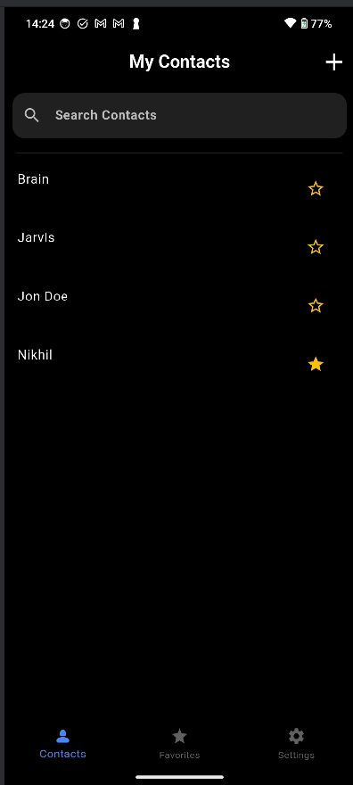
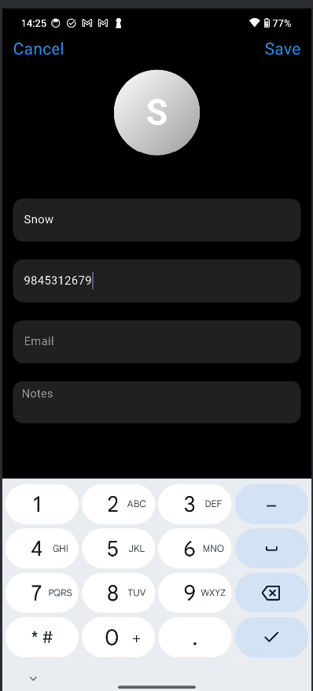
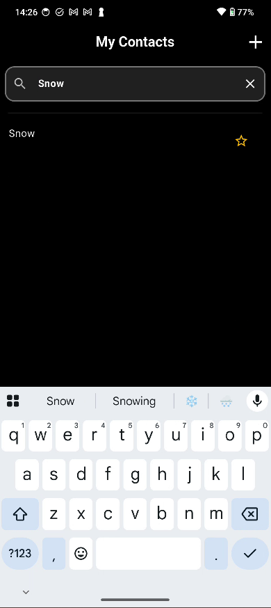
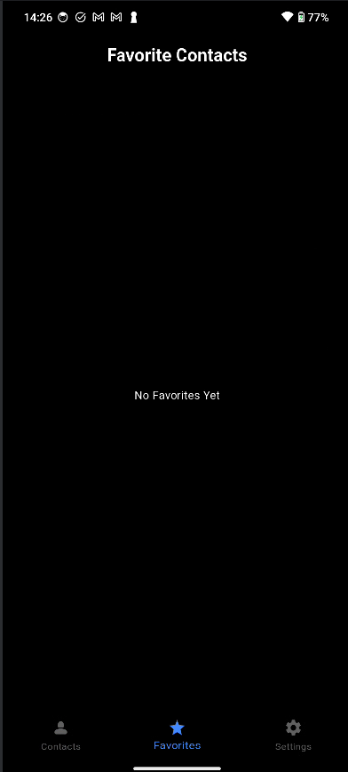
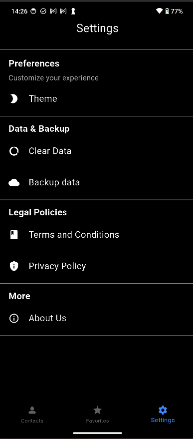

# 📱 Connex — Flutter Contact Manager App

Connex is a beautiful and lightweight contact manager built with Flutter and SQLite. It allows users to add, edit, delete, and favorite contacts with a clean and intuitive UI.

---

## ✨ Features

- ✅ Add new contacts with name, phone number, email, and notes  
- ✏️ Edit existing contact details  
- 🌟 Mark contacts as favorites  (In -progress)
- 📋 View detailed contact pages  
- 🗑️ Delete contacts
- 🔄 Data persistence using SQLite (via `sqflite`)  
- 📱 Smooth navigation using `BottomNavigationBar`  

---
## 📸 Screenshots

### 1

### 2

### 3

### 4

### 5

